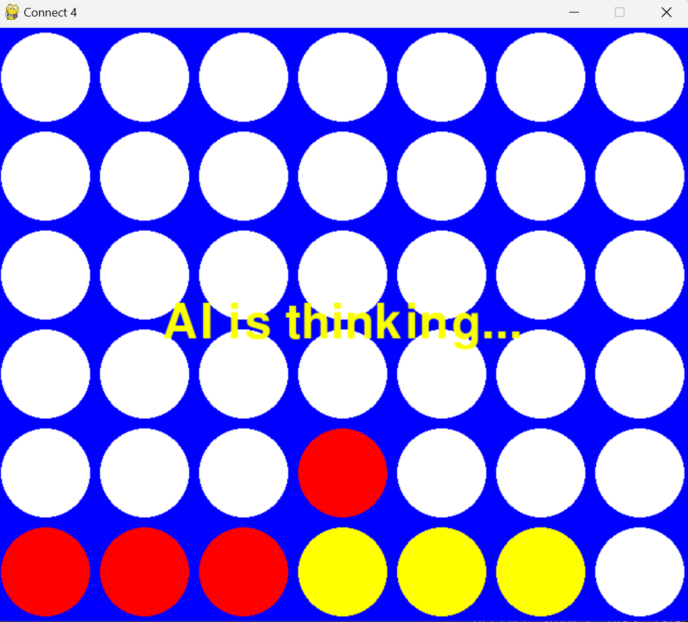

# Connect 4 Game with Min-Max and Alpha-Beta Pruning

This project implements the classic game of Connect 4 with an AI opponent powered by the Min-Max algorithm for decision-making and Alpha-Beta Pruning for optimization. The game provides an interactive environment where players can compete against the AI or play against each other.

## Game Rules

Connect 4 is a two-player connection game in which the players first choose a color and then take turns dropping colored discs from the top into a seven-column, six-row vertically suspended grid. The pieces fall straight down, occupying the lowest available space within the column. The object of the game is to connect four of one's own discs of the same color next to each other vertically, horizontally, or diagonally before your opponent.

## Min-Max Algorithm

The Min-Max algorithm is a decision-making algorithm that aims to minimize the maximum possible loss (minimize the worst-case scenario) in a game. In Connect 4, it helps the AI determine the best move by simulating future game states and evaluating them.

## Alpha-Beta Pruning

Alpha-Beta Pruning is an optimization technique used with the Min-Max algorithm to reduce the number of nodes evaluated in the search tree. It prunes branches of the search tree that need not be evaluated because there already exists a better move available.

## Technologies Used

- Python
- Pygame

